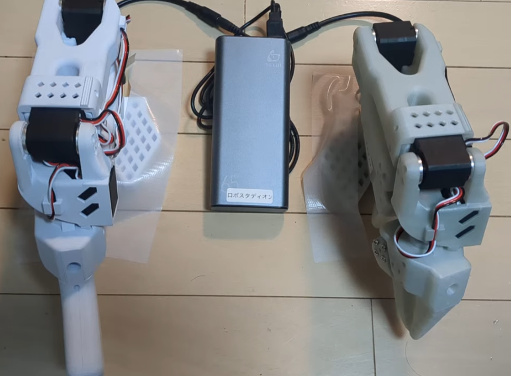
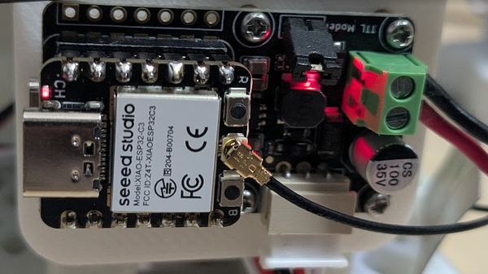
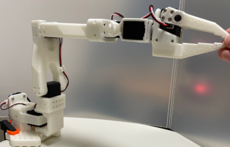

# SO-101 Leader-Follower (ESP-NOW)



ESP-NOW 経由で SO-101 ロボットアームの Leader-Follower テレオペを行うファームウェア。
WiFi AP 不要の直接 peer-to-peer 通信で、WiFi UDP 版 (SO101_wifi_ap_control) より低遅延。

**デモ動画**: [Twitter / X @robostadion](https://x.com/robostadion/status/2043876691672793417)

---

## ⚡ シンプルな検証方法 (PlatformIO / Python 不要、ブラウザのみ)

**Chrome / Edge デスクトップ版**があれば、PlatformIO も Python も git clone も不要で teleop まで到達できます。

### Step 1. 書込み

> ### 🌐 [Web Serial Installer を開く](https://uecken.github.io/SO101_ESPNOW_control/)

上記 URL をブラウザで開き、該当 MCU (M5StickC / AtomS3 / XIAO ESP32-C3 / XIAO ESP32-S3) を USB 接続 → 「書込む」ボタン → シリアルポート選択 → 自動書込み完了。

### Step 2. Leader / Follower 設定 (同じページで続行)

書込み後、ページ下部の **「書込み後の初回設定」** セクションで:

1. **「① シリアル接続 (115200)」** ボタン → 対象の COM port を選択
2. 1 台目 (Leader) は **「② Leader 設定 + 開始」** クリック
3. 2 台目 (Follower) を USB に挿しなおして **「② Follower 設定 + 開始」** クリック

### Step 3. teleop 動作

両機 RUNNING 状態で Leader 腕を動かすと Follower 腕が 1:1 追従。設定は NVS 永続化されるため、次回以降は電源 ON のみで自動起動。

---

## 構成

```
Leader MCU ──UART 1Mbaud──> STS3215 x6 (READ)
     │
     │ ESP-NOW broadcast (25B/pkt, 50Hz, 片方向遅延 1-3ms)
     │
     └──> Follower MCU ──UART 1Mbaud──> STS3215 x6 (SYNC_WRITE)
```

WiFi AP は不要。ESP-NOW は broadcast (FF:FF:FF:FF:FF:FF) で自動接続。

## ハードウェア構成

### MCU (teleop 用) — 以下のいずれか

Leader/Follower 各 1 台で計 2 台必要。同じ MCU 推奨。異種混在は未検証。

| パーツ | リンク |
|-------|-------|
| M5StickC (ESP32-PICO) | [M5Stack 公式](https://shop.m5stack.com/products/stick-c) |
| M5Stack AtomS3 | [M5Stack 公式](https://shop.m5stack.com/products/atoms3-dev-kit-w-0-85-inch-screen) |
| XIAO ESP32-C3 | [Seeed Studio 公式](https://www.seeedstudio.com/Seeed-XIAO-ESP32C3-p-5431.html) |

### サーボバスドライバ基板 (ESP32 ⇔ STS3215 の UART 半二重通信基盤)



MCU に応じて以下のいずれかを使用:

| MCU | 推奨ボード | リンク |
|-----|----------|-------|
| **XIAO シリーズ** | Waveshare シリアルバスサーボドライバ | [秋月電子 M-17068](https://akizukidenshi.com/catalog/g/g131227/) |
| **M5StickC / M5Stack AtomS3** | FEETECH サーボ用インターフェイスボード **FE-URT-1** | [秋月電子 M-16295](https://akizukidenshi.com/catalog/g/g116295/) |

いずれも **サーボ connector + 5V/7.4V 電源分配 + 半二重 UART 合流 + USB-UART ブリッジ** を提供する Feetech 互換ボード。MCU 側のピン配置 (XIAO の Dupont ピン / M5 の Grove) に合わせて選択。

teleop 時は MCU が Waveshare に乗って駆動。**キャリブレーション (`so101_calibrate.py`) 実行時は現状、Waveshare 本体の USB ポートに PC を直接接続する必要がある** (MCU 経由の透過モードは未対応)。

### ロボットアーム

| パーツ | リンク |
|-------|-------|
| **SO-ARM100 / SO-101** (3D print + BOM) | [TheRobotStudio/SO-ARM100](https://github.com/TheRobotStudio/SO-ARM100) |
| STS3215 サーボ (Feetech) | [Feetech 公式](http://www.feetechrc.com/) |
| LeRobot (学習フレームワーク) | [huggingface/lerobot](https://github.com/huggingface/lerobot) -- **模倣学習は対応検討中** |

## 対応ボード

| env | MCU | サーボ TX/RX | 備考 |
|-----|-----|------------|------|
| `m5stick-c` | M5StickC (ESP32) | GPIO32 / GPIO33 | UART2 (bridge 用): GPIO26 / GPIO36、**動作確認済** |
| `m5stack-atoms3` | M5Stack AtomS3 (ESP32-S3) | GPIO2 / GPIO1 | USB-CDC、**動作確認済** |
| `xiao-esp32c3-scs-recognize` | XIAO ESP32-C3 | GPIO21 / GPIO20 | シングルコア、ESP-NOW 50Hz で動作確認済 |
| `xiao-esp32s3` | XIAO ESP32-S3 | GPIO43 / GPIO44 | ビルド成功、実機動作未検証 |
| `xiao-esp32c6` | XIAO ESP32-C6 | GPIO16 / GPIO17 | ❌ **UART 1Mbaud 動作しない** (下記参照) |

## 開発環境

| 項目 | バージョン / 内容 |
|------|----------------|
| **ビルドシステム** | [PlatformIO](https://platformio.org/) |
| **フレームワーク** | **Arduino framework v2** (ESP-IDF 4.4 ベース、C3/S3/M5StickC) |
| **Platform** | `espressif32@6.9.0` (C3/S3/M5StickC)、`platform-seeedboards` (C6) |
| UART driver | ESP-IDF `driver/uart.h` (Arduino `Serial` ではなく直接使用、1Mbaud 安定化のため) |
| WiFi stack | ESP-NOW (`esp_now.h`) broadcast, AP 不要 |
| NVS | Arduino `Preferences` (ESP-IDF NVS ラッパ) |

### XIAO ESP32-C6 の既知問題 ❌

**ビルドは成功するが、UART 1Mbaud でのサーボ通信が動作しない。**

| 検証項目 | 結果 |
|---------|------|
| ビルド (Seeed platform, Arduino Core 3.3.7 / IDF 5.5) | ✅ 成功 |
| 書込み (esptool, `PYTHONIOENCODING=utf-8` で cp932 回避必要) | ✅ 成功 |
| Serial USB-CDC (コマンド応答 + NVS 設定) | ✅ 正常 |
| ESP-NOW 初期化 (MAC / WiFi config) | ✅ 正常 |
| **UART 1Mbaud STS3215 サーボ通信** | **❌ 動作しない** |

- UART0 / UART1 の両方でテスト → いずれも servo scan = 0 台
- GPIO16/17 (D6/D7) のピンマッピングは variant ファイルで確認済 (正しい)
- `uart_driver_install` / `uart_param_config` / `uart_set_pin` は全て ESP_OK 返却
- source_clk を `UART_SCLK_DEFAULT` (IDF 5.x) に修正済
- 同一の Waveshare サーボドライバ + 同一サーボで XIAO C3 は正常動作
- 以前の `sts3215_1mbaud_benchmark` (Arduino v2 / IDF 4.4) でも同じ症状 (C6 UART READ 100% failure)

**原因不明**: ESP-IDF の C6 UART ドライバまたはピンマトリックスの問題の可能性。
Seeed / Espressif の IDF アップデート後に再検証予定。**現時点では C3 / S3 / M5StickC を使用してください。**

## ファームウェア書込み

### 🌐 Web ブラウザから (推奨 / 初心者向け)

PlatformIO 不要。**Chrome / Edge デスクトップ版** から以下の URL を開き、ボタンを押すだけ:

> **[→ Web Serial Installer](https://uecken.github.io/SO101_ESPNOW_control/)**

対応 MCU: **M5StickC / M5Stack AtomS3 / XIAO ESP32-C3 / XIAO ESP32-S3**。
書込み後はそのまま同じページで Leader / Follower 設定 + シリアルモニタも可能。

### PlatformIO からビルド (開発者向け)

同一バイナリを 2 台にアップロード。役割はシリアルで設定。

```bash
cd SO101_leader_follower

# M5StickC
pio run -e m5stick-c -t upload --upload-port COMxx

# AtomS3
pio run -e m5stack-atoms3 -t upload --upload-port COMxx
```

## 起動フロー (自動)

```
電源 ON → NVS load (mode/servo/WiFi 設定復元)
       → ESP-NOW init + WiFi 設定適用 (PHY rate / channel / AMPDU)
       → ST_SCANNING (自動開始、5 秒毎にリトライ)
       → 全サーボ ID 応答 → ST_RUNNING (自動遷移)
       → Leader: READ + ESP-NOW broadcast 開始 (50Hz)
       → Follower: ESP-NOW 受信 → SYNC_WRITE 開始
```

**`s` コマンドは不要** (起動時に自動で SCANNING → RUNNING)。サーボ未接続時は SCANNING で待機。

## 初回設定 (書込み後 device 毎に 1 回)

`python/so101_setup.py` を使えば **1 コマンドで役割設定 + 開始** まで完了します。
Leader と Follower それぞれの USB COM port に対して実行:

### ワンショット設定 (推奨)

```bash
# Leader 側 (COMxx はデバイスの実 COM 番号に置換)
python python/so101_setup.py --port COMxx --leader --start

# Follower 側
python python/so101_setup.py --port COMyy --follower --start
```

`--leader --start` は内部で `x` (停止) → `m0` (モード設定) → `s` (開始) の 3 コマンドを順に送信し、
最後に `?` で STATUS を表示します。`state=RUNNING` になっていれば teleop 稼働中。

### シリアルモニタで手動設定したい場合

115200 baud でシリアル接続し、以下を打鍵:

```
m0 (Leader) / m1 (Follower)   ← 役割設定
s                              ← 開始
```

### NVS 永続化 — 次回以降は電源 ON だけで自動動作

モード・サーボ ID・WiFi 設定等はすべて NVS に永続化されるため、**書込み後 1 回設定すれば以後は電源 ON のみで自動 RUNNING 復帰** (`s` 不要)。
起動シーケンス: setup() → NVS load → ST_SCANNING 自動遷移 → 全サーボ ID 応答確認後に ST_RUNNING。

手動停止 (`x` 送信) 後の再開時のみ `--start` (または `s`) が必要。

## シリアルコマンド一覧

| コマンド | 説明 | NVS |
|---------|------|-----|
| `m<0\|1\|2>` | モード (0=LEADER, 1=FOLLOWER, 2=BRIDGE_LEADER) | ✓ |
| `s` | 開始 (ESP-NOW 初期化 → サーボスキャン → RUNNING) | - |
| `x` | 停止 (Follower は torque OFF) | - |
| `J<id1,id2,...>` | サーボ ID (例: `J1,2,3,4,5,6`) | ✓ |
| `I<n>` | 軸数 (1-6) | ✓ |
| `b<baud>` | サーボ baud (デフォルト 1000000) | ✓ |
| `G<us>` | 制御周期 us (デフォルト 20000 = 50Hz) | ✓ |
| `d` | デバッグ出力 ON/OFF | - |
| `?` | ステータス表示 | - |
| `h` | ヘルプ | - |
| **WiFi / ESP-NOW** | | |
| `R<n>` | PHY rate (0=1M_L, 3=11M_L, 8=24M, ...) | **✓** |
| `C<ch>` | WiFi channel (1-13, Leader/Follower で一致必須) | **✓** |
| `A<0\|1>` | AMPDU off/on (0=11b+g推奨, 1=11b+g+n) | **✓** |
| `P<dBm>` | TX power (2-21 dBm) | - |
| `W` | 現在の WiFi 設定表示 | - |

## 動作確認

```
?
```

正常時の表示 (Leader):
```
STATUS state=RUNNING mode=LEADER baud=1000000 axes=6 period=20000us
  espnow: send_ok=150 send_fail=0 recv=0
  read_ok=900 fail=0 cycle=3800us
  pos: [1]=1812 [2]=2040 [3]=2050 [4]=2020 [5]=1980 [6]=1382
```

正常時の表示 (Follower):
```
STATUS state=RUNNING mode=FOLLOWER baud=1000000 axes=6 period=20000us
  espnow: send_ok=0 send_fail=0 recv=150
  write_ok=150
```

## SCS プロトコル (STS3215)

共通ライブラリ [lib/scs_feetech_servo/scs_feetech_servo.h](lib/scs_feetech_servo/scs_feetech_servo.h) を使用:

| 操作 | 関数 | アドレス |
|------|------|---------|
| Position READ | `scs_build_read()` + `scs_parse_position()` | 0x38 (PRESENT_POSITION, 2B) |
| Position WRITE | `scs_build_sync_write_pos_full(.., 0, 0)` | 0x2A (GOAL_POSITION + TIME + SPEED, 6B/servo) |
| Torque ON/OFF | `scs_build_torque()` | - |
| PING | `scs_build_ping()` | - |

パケットフォーマット: `[0xFF][0xFF][ID][LEN][INST][PARAMS...][CHECKSUM]`

## 性能

| 項目 | 値 |
|------|---|
| 通信方式 | ESP-NOW broadcast |
| 片方向遅延 (Leader→Follower) | **1-3 ms** |
| 制御レート | **50 Hz** (デフォルト) |
| サーボ baud | 1 Mbaud |
| UART READ 時間 | ~3.8 ms / 6 軸 |
| WiFi AP | 不要 |
| PC 接続 | 不可 (ESP-NOW は直接通信) |

## トラブルシューティング

| 症状 | 対処 |
|------|------|
| Follower が受信しない (recv=0) | 両方が同じ WiFi channel にいるか確認。`x` → `s` で再初期化 |
| READ 失敗が連続 | サーボ配線 (TX/RX バスバー + DATA) / 5V 電源 / GND 共通を確認 |
| 10 回連続 READ 失敗で自動停止 | `s` で再開始 |
| AtomS3 でシリアルモニタ開くと再起動 | USB-CDC の DTR リセット。`--raw` フラグで抑制 |
| サーボが遅い | `scs_build_sync_write_pos_full(.., 0, 0)` で速度 max 強制済。EEPROM Moving Speed は無視される |

## Python ツール

PC からの設定・テストスクリプトは [python/](python/) を参照。
- `so101_setup.py` -- mode / servo ID / **WiFi channel・PHY rate (NVS)** 設定
- `so101_calibrate.py` -- STS3215 キャリブレーション
- `so101_leader_follower_test.py` -- 追従精度テスト

詳細: [python/README.md](python/README.md)

## キャリブレーション基本姿勢 (重要)

`so101_calibrate.py` 実行中の Step 2 で「**各関節を可動域の MIDDLE に置いてください**」
と指示されますが、この **「MIDDLE」は関節の物理的 (機械的) 可動域の真ん中** であり、
**見た目がまっすぐな姿勢ではありません**。



上図の姿勢で両腕を配置してから Step 2 の ENTER を押してください。
中央から外れた位置で ENTER すると、Homing_Offset が不正になり、teleop 時に
Present_Position が 0/4095 境界を wrap して **サーボが突然反対方向に大きく回転する**
現象が発生します。

**Leader 腕と Follower 腕は同一姿勢** に揃えてからキャリブレーションしてください。
両腕で「MIDDLE ポーズ = Present_Position 2047」が同じ物理姿勢を指すようになり、
teleop で 1:1 追従が成立します。

キャリブレーション手順詳細とトラブルシュートは [python/README.md](python/README.md) 参照。

キャリブレーションの原理 (Feetech サーボ内部処理 / LeRobot 方式 / SO101_leader_follower FW の pass-through 設計の差) は [docs/202604162200_calibration-method-comparison.md](docs/202604162200_calibration-method-comparison.md) を参照。

## 関連プロジェクト

- [rs485_espnow_bridge](https://github.com/uecken/RS-485_wireless/tree/master/rs485_espnow_bridge) -- RS-485 ↔ ESP-NOW 双方向透過ブリッジ

---

## Appendix: Bridge Leader モード (m2、M5StickC 専用・旧検証用)

本体機能とは **独立した旧検証モード**。通常の teleop 構成 (m0/m1) では使用しません。

UART2 (GPIO26/36) で Leader アームを READ し、組み立てた SYNC_WRITE を UART1 経由で
[rs485_espnow_bridge](https://github.com/uecken/RS-485_wireless/tree/master/rs485_espnow_bridge) の bridge_L に渡すハイブリッド中継モード。
既存の「PC/コントローラ → RS-485 → bridge → ESP-NOW → bridge → Follower」構成に
ESP32 teleop を挟み込む検証用。

- M5StickC 限定 (UART2 用ピンが必要)
- シリアル `m2` で選択
- FW 側コードは維持、README 本文から独立させただけ
